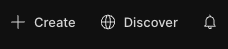
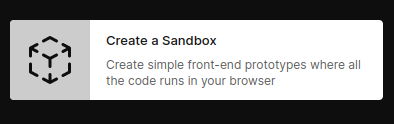
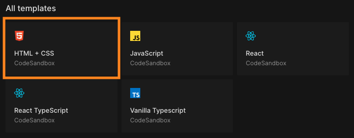
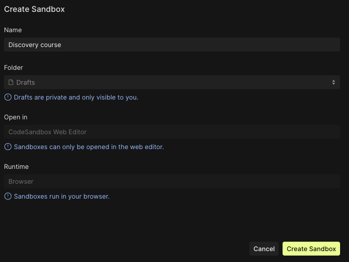

[← retour page accueil](./)

# Codesandbox.io : nouveau projet

## Créer un Sandbox sur Codesandbox.io

1. Connecte-toi à ton compte sur [Codesandbox](https://codesandbox.io/) et crée un nouveau Sandbox à l’aide du bouton «&nbsp;**+&nbsp;Create**&nbsp;»  

1. Sélectionne « **Create simple front-end prototypes** »  

1. Puis choisis  « **HTML + CSS** » dans la liste des templates  

1. Enfin donne un nom à ton Sandbox  
