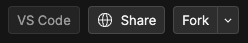
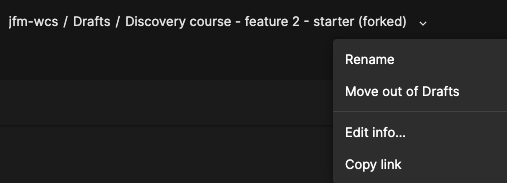

[← retour page accueil](./)

# Codesandbox.io : faire un Fork

## Créer une copie d'un Sandbox sur Codesandbox.io

1. Accède à un Sandbox et effectue une copie à l'aide du bouton «&nbsp;**Fork**&nbsp;»  

1. Tu peux ensuite renommer, déplacer dans un autre dossier ou éditer les informations à l'aide du menu contextuel :  
