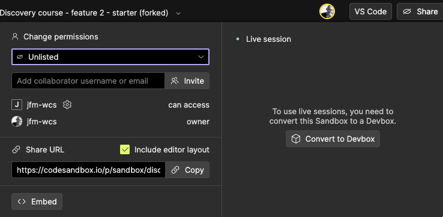

[← retour page accueil](./)

# Publier un Sandbox sur Codesandbox.io

## En utilisant le bouton **Share**
1. Si le Sandbox est dans le dossier brouillon, déplacer le Sandbox en dehors du dossier avec le bouton « **Move out of Drafts** »  
   
2. Changer les permissions  
     
   et choisir le réglage désiré  
   
3. Donner accès directement au Sandbox via la section « **Share URL** ».  
   - Si elle est activée, l'option « **Include editor layout** » permet de partager la disposition des onglets et des différents panneaux ouverts.  
   - Cliquer sur **Copy** pour copier l'URL.  
    
4. Donner accès à la version plein écran (en dehors du Sandbox) grâce au buton « **Open in a new tab** ».  
   Attention, les projets du dossier brouillon ne peuvent être ouverts avec des fichiers CSS ou JavaScript associés.
   